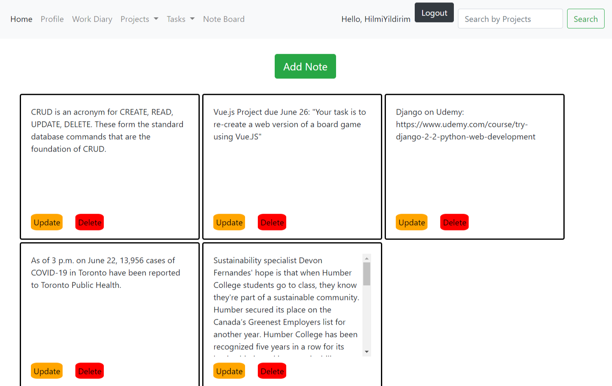
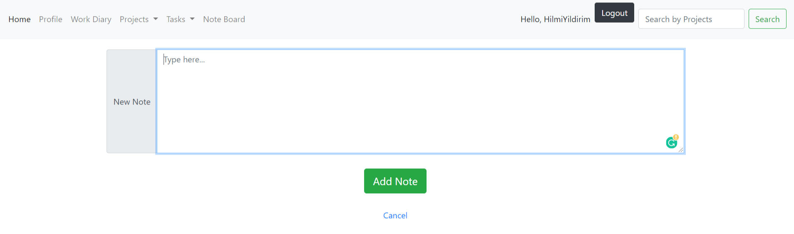

# Feature: NoteBoard
_*by Hilmi Yildirim*_
  
### Description

The users will have a board to take notes similar to sticky notes on Windows. 
They will be able to create, update, delete notes on the board to keep the additional information. 
As the users complete their tasks on the website and track their works, 
this feature will be a nice tool to keep extra information handy.  
  
### Screenshots  
  
*Note Board Main Page*  
    
  
*Add a new note*
  
  
## Task List  
  
### Learning Items & Notes
- [x] Python Crash Course
- [x] Django course intro
- [x] Django Hello World project  
- [x] Django models
- [x] Django views & urls
- [x] Django forms

### Action Items   
- [x] Project Setup: PyCharm, Django, GitHub Repo, ...
- [x] ERD
- [x] Design & Wireframes
- [x] Implementing Models & Admin management
- [x] Coding Templates (HTML/CSS)
- [x] Building Views & URLs
- [x] Completing the CRUD functions
  
- [x] Project Phase Submissions
- [x] Group Meetings
   

  

