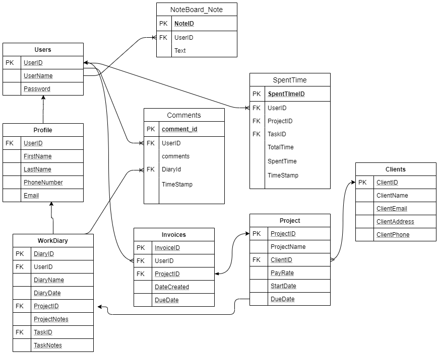

# Work Tracking System _by NoName_  

  
  
**Project Folder:** [HTTP5303 - Web Project Google Drive](https://drive.google.com/open?id=1mmVmalxWiqwlrVFrN070fYyj8wlPAneu)  
  
## Learning Stack
  
- Python + Django
- MySQL
- SASS
- Design tools: Figma / Adobe XD

## Project Timeline (tentative)
- Week 1-3: Learning & Designing  
- Week 4-6: İmplementation  
- Week 7: Testing and Reporting  

## Project Basics  

### Color Palette  
   
 
### ERD  
 
